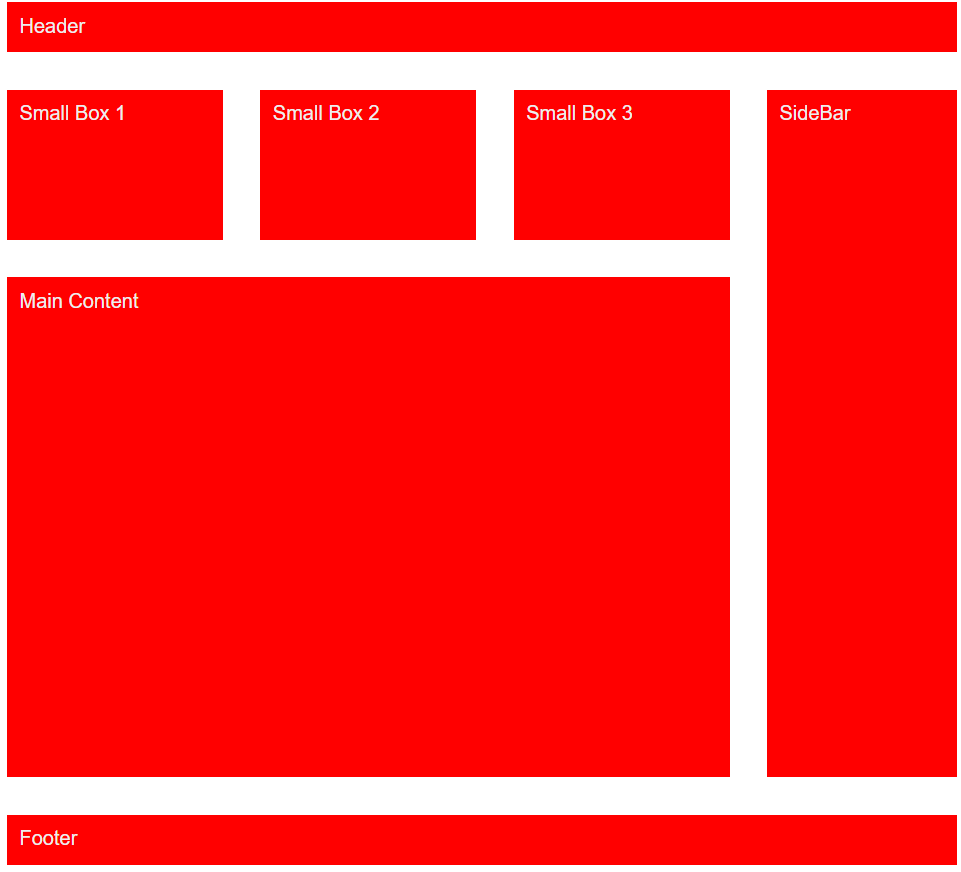
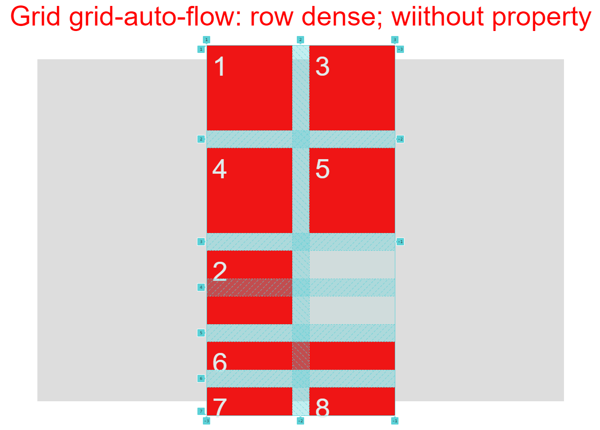
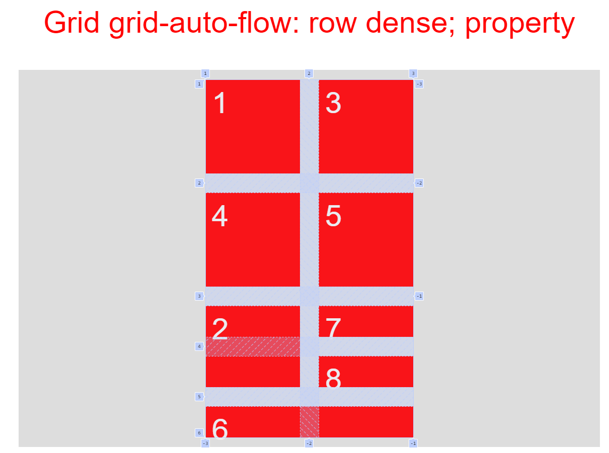
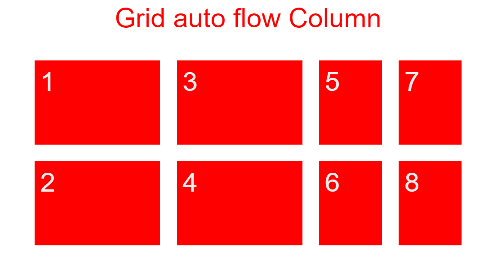
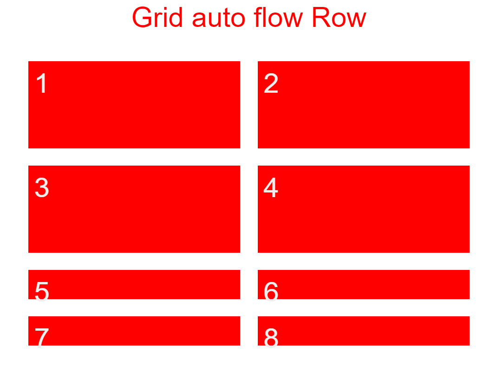
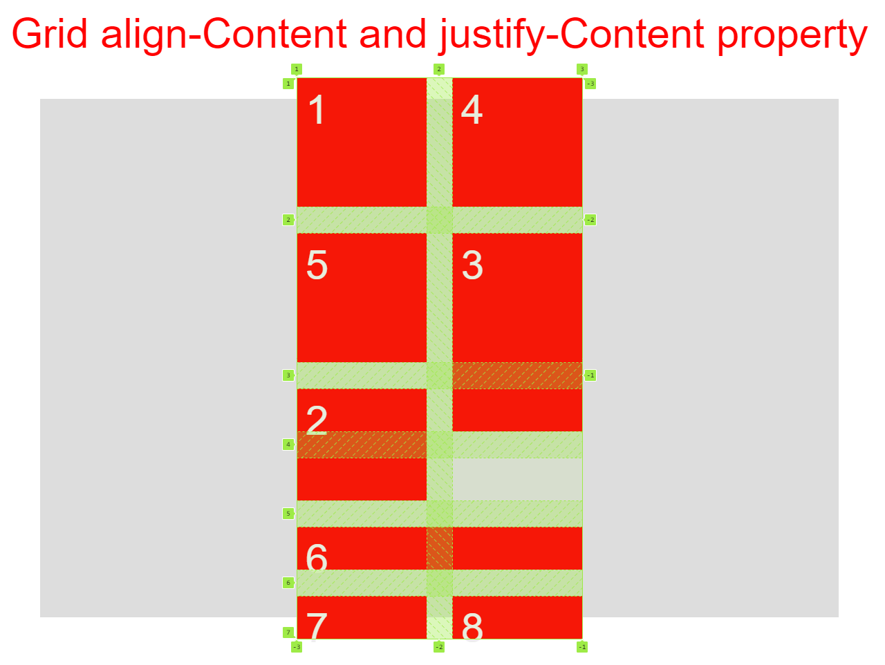
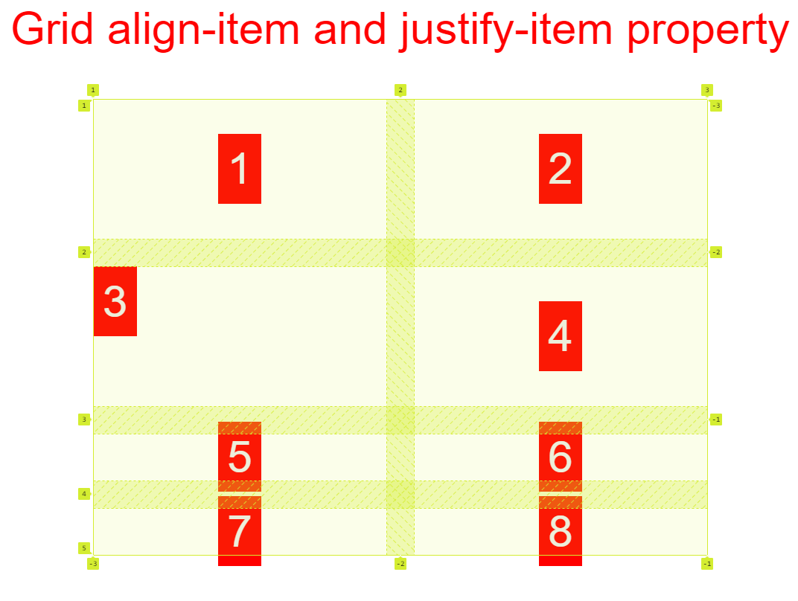
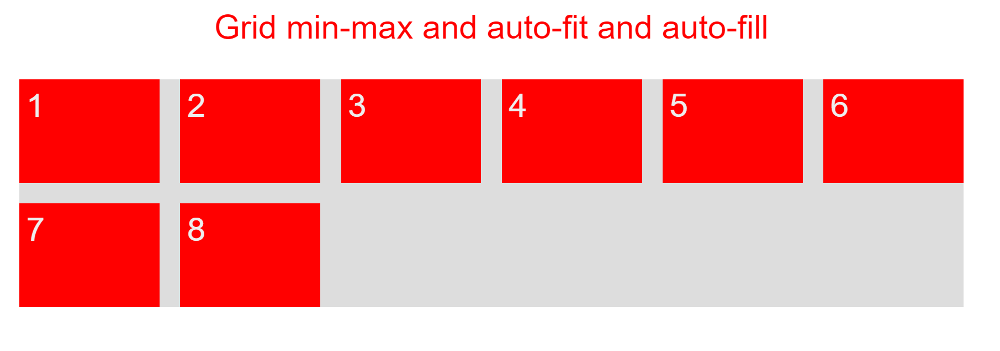
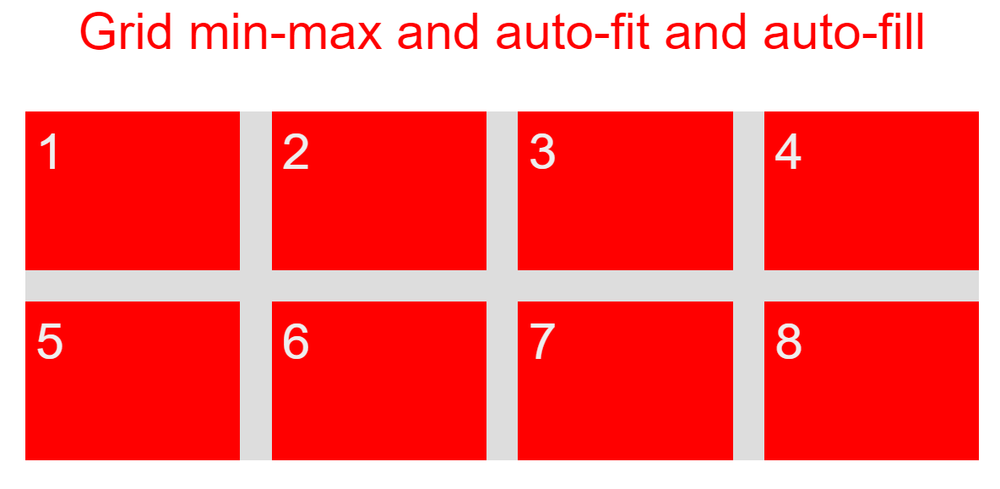
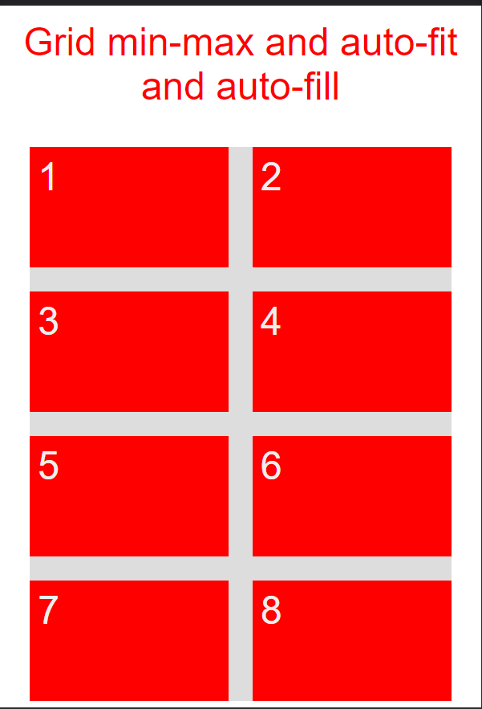

# 100 Days Of Code

### Day 0: January 17, 2022

<!-- ##### () -->

**Today's Progress**: Completed trillo project of [Advanced CSS and Sass Course](https://www.udemy.com/course/advanced-css-and-sass/?src=sac&kw=advance+css+and+sass)

**Thoughts:** It was Amazing to do the Project. I learned Lot About Css FlexBox. Property I learned during this was Mask-image, mixins is sass, Proper user of flex grow,shrink,basis,etc.

**Link to work:** [Project Final Repo](https://github.com/Chandraprakash-Darji/Trillo-Final-Advanced-CSS-and-Sass-Course)

### Day 1: January 18, 2022

**Today's Progress**: Learned About Css Grid from [Advanced CSS and Sass Course](https://www.udemy.com/course/advanced-css-and-sass/?src=sac&kw=advance+css+and+sass)

**Thoughts:** Grids are amazing to arrange layout on webpage.

**Properties I learned:**

```scss
body {
  display: grid;
  grid-template-columns: 150px 1fr; // 1fr is awailable space
  grid-template-rows: repeat(2, 150px) 300px; // 150px 150px 300px

  grid-row-gap: 30px;
  grid-column-gap: 30px;

  grid-gap: 30px;

  grid-row-start: 2;
  grid-row-end: 3;
  grid-row: 2 / 3; //  grid-row-start: 2;  grid-row-end: 3;

  grid-column-start: 2;
  grid-column-end: 3;
  grid-column: 2 / 3; //     grid-column-start: 2;   grid-column-end: 3;

  grid-area: 2 / 2 / 3 / -1; //   grid-row:  2 / 3;    grid-column: 2 / 3;
  // -1 indicates last column/row line
  grid-column: 1 / span 3; // it will span 3 from 1
}
```

**What I learned and Created:**

```html
<div class="grid">
  <div class="grid__head">Header</div>
  <div class="grid__sm-box--1">Small Box 1</div>
  <div class="grid__sm-box--2">Small Box 2</div>
  <div class="grid__sm-box--3">Small Box 3</div>
  <div class="grid__side-bar">SideBar</div>
  <div class="grid__main">Main Content</div>
  <div class="grid__footer">Footer</div>
</div>
```

```scss
.grid {
  display: grid;
  color: #eee;
  font-family: sans-serif;

  width: 50%;
  margin: 0 auto;
  grid-template-columns: 1fr 1fr 1fr 20%;
  grid-template-rows: 40px 120px 400px 40px;
  grid-gap: 30px;

  & > * {
    background-color: red;
    padding: 10px;
  }

  &__head {
    // grid-row: 1 / 2;
    grid-column: 1 / -1;
  }

  &__side-bar {
    grid-row: 2 / -2;
    // grid-column: -2 / -1;
    // height: 500px;
  }
  &__main {
    grid-row: 3 / 4;
    grid-column: 1 / -2;
  }
  &__footer {
    // grid-row: 4 /5;
    grid-column: 1 / -1;
  }
}
```

**Screenshot I Created:**


### Day 2: January 19, 2022

**Today's Progress**: Completed Learning About Css Grid from [Advanced CSS and Sass Course](https://www.udemy.com/course/advanced-css-and-sass/?src=sac&kw=advance+css+and+sass) And started Project 3 named "Nexter"

**Thoughts:** Comppleted all the properties of css grid. Now its time to make implementation.I also learned how element is arranged in real world css grid.

**Properties I learned:**

```scss
.grid {
  grid-template-columns: repeat(3, [col-start] 1fr [ col-end]) 100px [grid-end];
  grid-template-rows: [Header-start] 40px [Header-end Box-start] 120px [Box-end Main-start] 400px [Main-end footer-start] 40px [footer-end];
  grid-gap: 30px;
  grid-template-areas:
    ". head head ."
    "box-1 box-2 box-3 side"
    "main main main side"
    "foot foot foot foot";
  grid-auto-flow: row dense; // item will flow in row
  grid-auto-rows: 50px; // new item in row will have height of 50px
  grid-auto-columns: 0.5fr; // new item in col will have width .5fr only used when  grid-auto-flow: column;

  // Aligment of item
  align-items: center;
  justify-items: center;

  // Aligment of whole grid
  align-content: center;
  justify-content: center;

  grid-template-rows: repeat(2, minmax(150px, min-content));
  grid-template-columns: repeat(
    auto-fill,
    100px
  ); // automatically create track according to itens in them ..  11 track 1000 / 100 = 10 But collapse to the number of item which is 8 ..
  grid-template-columns: repeat(
    auto-fit,
    100px
  ); // automatically create track according to itens in them ..  11 track 1000 / 100 = 10
}
```

**What I Practised while learning.**
**Grid Layout 1**

```html
<div class="grid__head">Header</div>
<div class="grid__sm-box--1">Small Box 1</div>
<div class="grid__sm-box--2">Small Box 2</div>
<div class="grid__sm-box--3">Small Box 3</div>
<div class="grid__side-bar">SideBar</div>
<div class="grid__main">Main Content</div>
<div class="grid__footer">Footer</div>
```

```scss
// By Grid-line Number
.grid {
  display: grid;

  grid-template-columns: 1fr 1fr 1fr 20%;
  grid-template-rows: 40px 120px 400px 40px;
  grid-gap: 30px;

  &__head {
    grid-column: 1 / -1;
  }

  &__side-bar {
    grid-row: 2 / -2;
  }
  &__main {
    grid-row: 3 / 4;
    grid-column: 1 / -2;
  }
  &__footer {
    grid-column: 1 / -1;
  }
}

//  By Grid-line Name
.grid {
  display: grid;

  grid-template-columns: repeat(3, [col-start] 1fr [ col-end]) 100px [grid-end];
  grid-template-rows: [Header-start] 40px [Header-end Box-start] 120px [Box-end Main-start] 400px [Main-end footer-start] 40px [footer-end];
  grid-gap: 30px;

  &__head {
    grid-column: col-start 1 / grid-end; // grid-column: 1 / -1;
  }

  &__side-bar {
    grid-row: Box-start / Main-end; // grid-row: 2 / -2;
  }
  &__main {
    grid-column: col-start 1 / col-end 3; //  grid-column: 1 / -2;
    grid-row: Main-start / Main-end; // grid-row: 3 / 4;
  }
  &__footer {
    grid-column: col-start 1 / grid-end; // grid-column: 1 / -1;
  }
}

//  Gird by Naming each box
.grid {
  display: grid;

  grid-template-areas:
    ". head head ."
    "box-1 box-2 box-3 side"
    "main main main side"
    "foot foot foot foot";

  &__head {
    grid-area: head;
  }
  &__sm-box--1 {
    grid-area: box-1;
  }
  &__sm-box--2 {
    grid-area: box-2;
  }
  &__sm-box--3 {
    grid-area: box-3;
  }
  &__side-bar {
    grid-area: side;
  }
  &__main {
    grid-area: main;
  }
  &__footer {
    grid-area: foot;
  }
}
```

**Grid Layout 2**

```html
<div class="grid2">
  <div class="item item--1">1</div>
  <div class="item item--2">2</div>
  <div class="item item--3">3</div>
  <div class="item item--4">4</div>
  <div class="item item--5">5</div>
  <div class="item item--6">6</div>
  <div class="item item--7">7</div>
  <div class="item item--8">8</div>
</div>
```

```scss
// inplicit and explicit grid
.grid2 {
  display: grid;
  background-color: #ddd;
  width: 100px;

  margin: 0 auto;
  margin-top: 40px;
  grid-template-rows: repeat(2, 150px);
  grid-template-columns: repeat(2, 150px);
  grid-gap: 30px;

  grid-auto-flow: row dense; // item will flow in row
  grid-auto-rows: 50px; // new item in row will have height of 50px
  grid-auto-columns: 0.5fr; // new item in col will have width .5fr only used when  grid-auto-flow: column;

  // Aligment of item
  align-items: center;
  justify-items: center;

  // Aligment of whole grid
  align-content: center;
  justify-content: center;

  grid-template-rows: repeat(2, minmax(150px, min-content));
  grid-template-columns: repeat(
    auto-fill,
    100px
  ); // automatically create track according to itens in them ..  11 track 1000 / 100 = 10 But collapse to the number of item which is 8 ..
  grid-template-columns: repeat(
    auto-fit,
    100px
  ); // automatically create track according to itens in them ..  11 track 1000 / 100 = 10

  width: 90%;
  grid-template-columns: repeat(auto-fit, minmax(200px, 1fr));
  grid-auto-rows: 150px;
}
```

**Screenshot I take While Learning**










### Day 3: January 20, 2022

**Today's Progress**: Completed whole [Advanced CSS and Sass Course](https://www.udemy.com/course/advanced-css-and-sass/?src=sac&kw=advance+css+and+sass) And started Project 3 named "Nexter"

**Thoughts:** It was Amazing ride of completeing the course. I Just loved it complete it.

**Next Step** Started Javscript with [The Complete JavaScript Course 2022: From Zero to Expert!](https://www.udemy.com/course/the-complete-javascript-course/?utm_campaign=website1010&utm_medium=website1010&utm_source=mycoupon)

**Project Completed while learning CSS and SASS are listed below**

- [Natours | Exciting tours for adventurous people](https://github.com/Chandraprakash-Darji/Natrous-Final-Advanced-CSS-and-Sass-Course)
- [trillo -- Your all-in-one booking app](https://github.com/Chandraprakash-Darji/Trillo-Final-Advanced-CSS-and-Sass-Course)
- [nexter -- your home, your freedom](https://github.com/Chandraprakash-Darji/Nexter-Final-Advanced-CSS-and-Sass-Course)

### Day 4: January 21, 2022

**Today's Progress**: Started learning JavaScript by [The Complete JavaScript Course 2022: From Zero to Expert!](https://www.udemy.com/course/the-complete-javascript-course/?utm_campaign=website1010&utm_medium=website1010&utm_source=mycoupon) It was Crazy fun.

**Thoughts:** Completed funadamentals Part 1. While Leaning i also Created the amzing notes for it. [Js-notes](https://github.com/Chandraprakash-Darji/Js-notes)

**Till Now HomeWork I completed** [What I learned](https://github.com/Chandraprakash-Darji/advance-js-learning-files)

### Day 5: January 22, 2022

**Today's Progress**: Completed half of Fundamentals in Js part 2.

**Notes link:** [Js-notes](https://github.com/Chandraprakash-Darji/Js-notes)

**Till Now HomeWork I completed** [What I learned](https://github.com/Chandraprakash-Darji/advance-js-learning-files)

### Day 6: January 23, 2022

**Today's Progress**: Completed Fundamentals in Js part 2 , Developer skills, Dom first Project

**Notes link:** [Js-notes](https://github.com/Chandraprakash-Darji/Js-notes)

**Till Now HomeWork I completed** [What I learned](https://github.com/Chandraprakash-Darji/advance-js-learning-files)

### Day 7: January 24, 2022

**Today's Progress**: Completed DOM all Project .

**Notes link:** [Js-notes](https://github.com/Chandraprakash-Darji/Js-notes)

**Till Now HomeWork I completed** [What I learned](https://github.com/Chandraprakash-Darji/advance-js-learning-files)

### Day 8: January 25, 2022

**Today's Progress**: Completed How Js works... But this topic was quite comfusing so i go on freecodecamp js course and completed one of practise of js to get certificate of js.. It was Number to Roman. It was Just amazing to solve.. First i solved in python and then convertd in js by self.

**JS Notes link:** [Js-notes](https://github.com/Chandraprakash-Darji/Js-notes)

**Till Now HomeWork I completed** [What I learned](https://github.com/Chandraprakash-Darji/advance-js-learning-files)

[NumberToRomanInJsAndPy](https://gist.github.com/Chandraprakash-Darji/695b24f375dffe143652002e1008ca99)

### Day 9: January 26, 2022

**Today's Progress**: Started Learning about Data Structure in JS. Today it was very in productive it was hard to complete fot my self.

**JS Notes link:** [Js-notes](https://github.com/Chandraprakash-Darji/Js-notes)

**Till Now HomeWork I completed** [What I learned](https://github.com/Chandraprakash-Darji/advance-js-learning-files)

### Day 10: January 27, 2022

**Today's Progress**: Learned About only Spread and rest Opertor..

**JS Notes link:** [Js-notes](https://github.com/Chandraprakash-Darji/Js-notes)

**Till Now HomeWork I completed** [What I learned](https://github.com/Chandraprakash-Darji/advance-js-learning-files)

### Day 11: January 28, 2022

**Today's Progress**: Learned About Sets , Map , Looping over Objects , Enhanced Object Litterals ...

**JS Notes link:** [Js-notes](https://github.com/Chandraprakash-Darji/Js-notes)

**Till Now HomeWork I completed** [What I learned](https://github.com/Chandraprakash-Darji/advance-js-learning-files)

### Day 12: January 29, 2022

**Today's Progress**: Learned About working with String and completed project of freecodecamp.org of js  Pallidrome checker,Caesars Cipher and Cash Register.

**JS Notes link:** [Js-notes](https://github.com/Chandraprakash-Darji/Js-notes)

**Till Now HomeWork I completed** [What I learned](shttps://github.com/Chandraprakash-Darji/advance-js-learning-files)

### Day 13: January 30, 2022

**Today's Progress**: Revision of note

### Day 14: January 31, 2022

**Today's Progress**: Completed 3 project from 50 days 50 project challenge course without watching video..